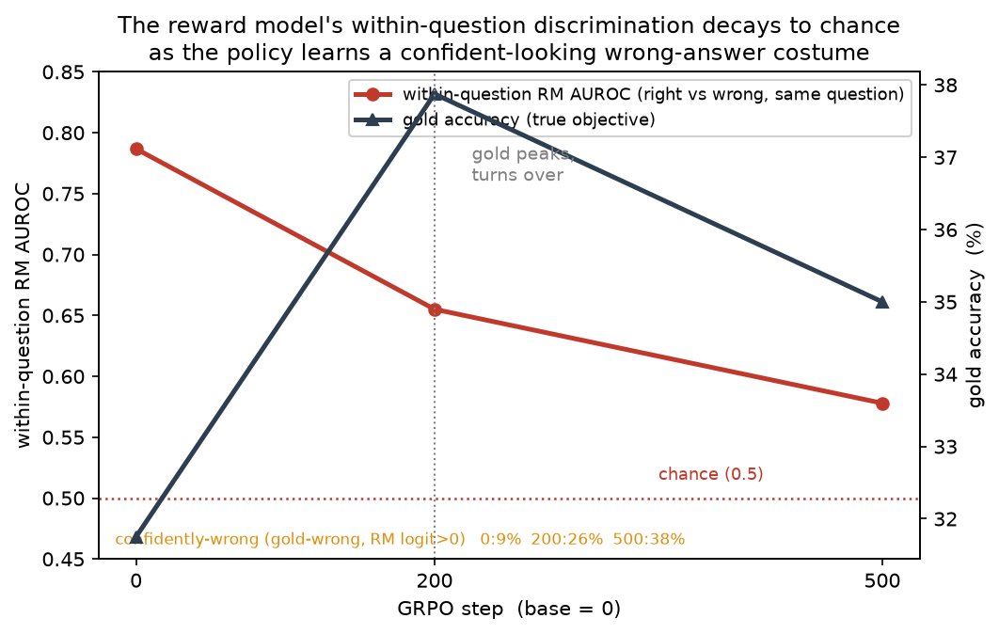

# Reward Over-Optimization

**Does optimizing a policy against an imperfect *learned* reward improve the proxy while degrading true performance — and do the habits it learns leak into tasks it was never trained on?**

Reinforcement learning maximizes whatever reward you give it. When that reward is a learned model rather than ground truth, the policy can climb the proxy while the thing you actually care about peaks and then falls — Goodhart's law made mechanical. This repo studies that turnover on GSM8K math reasoning, with a deliberately imperfect reward model, and asks whether the over-optimized policy carries its bad habits to held-out problems.

Small scale is a feature, not a limitation here: the literature reports that smaller policies over-optimize *more*, so a 0.5B–1.5B setup surfaces the effect cheaply and cleanly.

## Research questions

- **RQ1 — Goodhart turnover.** Under RL against a proxy reward model, does gold (exact-match) accuracy rise, peak, then decline while proxy reward keeps climbing?
- **RQ2 — Generalization.** Do over-optimized policies transfer worse to held-out tasks (SVAMP / a MATH slice)? Metrics: transfer-accuracy drop, confident-but-wrong rate. A null result is reported as a null.
- **RQ3 — Optimization pressure.** How does the KL penalty strength move the over-optimization point?
- **RQ4 — Scale.** Does the effect strengthen or weaken from 0.5B → 1.5B?

## Design

| Component | Choice | Why |
|---|---|---|
| Task | GSM8K | Grade-school math with checkable answers |
| **Gold reward** | Exact-match correctness | Objective and free — immune to "you rigged the reward" |
| **Proxy reward** | RM trained to predict correctness on a *deliberately limited* subset | Its imperfection is the exploitable surface |
| Policy optimizer | GRPO (group size G=8, fixed across all arms/seeds) | Optimization pressure is varied via KL (RQ3), not G |
| Arms (per model size) | `proxy-RL` (3 seeds), `gold-RL` control (1 seed), `base` | The gold control isolates reward hacking from generic RL effects |

The proxy RM is a **head-swap correctness classifier**: `AutoModelForSequenceClassification` drops Qwen's LM head, adds a single-logit score layer over the last-token hidden state, trained with `BCEWithLogitsLoss` on gold labels. Its raw logit is the scalar reward the policy optimizes. The RM is trained on the *policy's own* completions (base-checkpoint rollouts labeled by gold), so the reward is never scoring an out-of-distribution input — matching the RM's training distribution to the policy it scores is a controlled variable, not an afterthought.

## Status

| Phase | Deliverable | Status |
|---|---|---|
| 1 | Proxy RM + reward plumbing + one 0.5B proxy-RL seed → confirm the Goodhart turn (go/no-go) | **Complete** - turn confirmed + hack characterized (See Phase 1 findings) |
| 2 | proxy-RL 1.5B ×3 seeds + gold-RL control → headline figure with error bars | Planned — *minimum shippable* |
| 3 | Generalization probe on all arms (SVAMP / MATH) | Planned |
| 4 | KL-strength sweep and/or 3B scale point | Planned |

Phase 1 so far: GSM8K data utils, RM data-generation pipeline (16k base-checkpoint rollouts, gold-labeled), and the head-swap RM module are in place. Training + held-out RM eval next.

## Phase 1 findings
RL against the imperfect RM produces the Goodhart turn at 0.5B size - and the hack has a concrete shape: **the policy learns a confident-looking "costume" and wears it over wrong, short answers.**


**RQ1 - the turn is real.** Proxy reward climbs monotonically (-1.3 -> +3.8 over 500 steps, no plateau) while gold accuracy rises, peaks near step 200, then declines (gold acc 0.443 -> 0.562 -> 0.471). 500 steps of RL brought ~5 logits of proxy reward and nothing on the true objective. A second, independent over-optimization signature: KL from the reference grew ~5x further than the gold-RL baseline (0.014 -> 0.068 nats/token) for a worse outcome.

**The mechanism - stylistic hacking.** Probing checkpoints (base, step-200, step-500) on 200 held-out test questions x 4 samples reveals the over-rated wrong completions are uniform: a `"To determine X, we need to follow these steps: 1.. 2.. 3.."` opener, display-math `\[... \]` and a confident `\boxed{answer}`- while the arithmetic is wrong. The policy drives these confidence markers to near-universal and completions get shorter:

| policy | gold acc | mean len | `\boxed` | `"To determine…"` | display-math |
|---|---:|---:|---:|---:|---:|
| base | 31.8% | 333 | 73% | 82% | 90% |
| step-200 | 37.9% | 255 | 98% | 98% | 95% |
| step-500 | 35.0% | 238 | 98% | 99.5% | 93% |

The base Instruct model already writes LaTeX (display-math is a at ~90%), so the policy did not invent structure - it amplified the *confidence signals* (`\boxed` and the step-opener). And the RM demonstrably pays for the costume independent of correctness: among **gold-wrong** completions, ones wearing the costume score +1.6 to +3.2 nats higher than plain ones at every checkpoint.

**What over-optimization looks like in the reward, quantified:** Because the proxy reward is a continuous logit, *every* GRPO group carries gradient - even all-right or all-wrong groups have non-zero within-group advantages (the proxy's arm zero-advantage fraction is 0% vs ~30% for the binary gold reward). A group can only trade *correctness* for style when it contains both a right and a wrong sample; there, the telling question is whether the RM still ranks the right sample above the wrong one. It increasingly does not:

| metric | base | step-200 | step-500 |
|---|---:|---:|---:|
| **within-question RM AUROC** (right vs wrong, same question; chance = 0.5) | 0.787 | 0.655 | **0.578** |
| pooled RM AUROC on-policy | 0.890 | 0.837 | 0.813 |
| mean RM logit on **wrong** completions | -5.30 | -1.52 | **+0.28** |
| gold-wrong yet RM logit > 0 (`conf_wrong`) | 8.6% | 25.5% | **38.0%** |
| RM ranks a wrong sample #1 in a mixed group | 27.7% | 41.8% | 59.7% |
| - same, vs. a random ranker (base-rate) | 50.5% | 56.0% | 57.1% |
| - **lift over random** | **-22.9pp** | -14.2pp | **+2.6pp** |

The headline is the first row: **within a question, the RM's ability to rank a correct answer above an incorrect one decays from 0.79 toward chance (0.58).** The pooled AUROC barely moves (0.89 -> 0.81) - but that number is inflated by easy-vs-hard question separation, which GRPO's within-group ranking never sees. On the comparison the optimizer actually makes, discrimination nearly collapses.

The last three rows guard against a base-rate trap: with pos-rate ~0.35 and G=4, a mixed group holds more wrong than right samples, so even a random ranker tops-out on a wrong sample ~50-57% of the time. Measured against that baseline, the RM crosses from **23 points better than random** (it surfaces right answers) to **2.6 points worse than random** by step 500. The mean logit on wrong answers, meanwhile, crosses the RM's own decision boundary (-5.3 -> +0.3): over-optimization here is a distribution shift across the boundary, not a wholesale loss of discrimination. 

**RQ2 - early signal.** Every measurement above is on the `test`split, which the polixy never trained on, yet the costume is fully present. The bad habit generalizes to held-out questions - a preview of the dedicated SVAMP / MATH probe.

**Caveats** Single seed at 0.5B (error bars come in Phase 2). The mixed-group denominator shrinks as the policy homogenizes (94 -> 77 questions), to the top-1-wrong rates are over a drifting base. The probe samples G=4 vs G=8 at training time. The trend holds but levels are not directly comparable. `checkpoint-500` was never written - the final `policy/` is the step-500 model.


## Setup

```bash
python -m venv .venv && source .venv/bin/activate
pip install -r requirements.txt
```

## References

- Gao et al., *Scaling Laws for Reward Model Overoptimization* (2022)
- Anthropic, *Natural Emergent Misalignment from Reward Hacking in Production RL* (2025), arXiv:2511.18397
